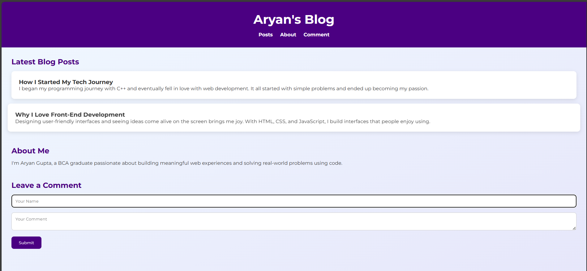

# Blogging Web Page

A responsive front-end blog layout built with HTML, CSS, and JavaScript.

## 💡 Features
- Simple responsive layout
- Collapsible menu for mobile view
- Comment form with basic validation
- Sections: Blog posts, About, Comment

## 🛠️ Tech Stack
- HTML5
- CSS3 (Media Queries)
- JavaScript (Vanilla)

## 📸 Preview

## 🧑 Author
Aryan Gupta
